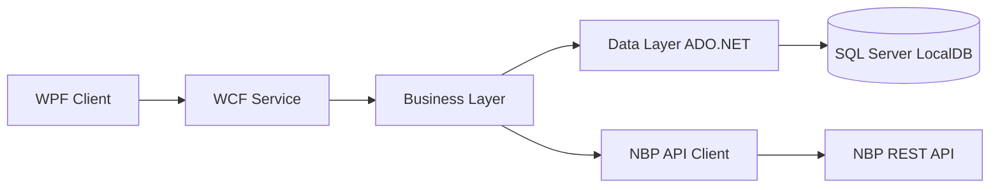

# Currency Exchange Office — Architecture

## Course

Network Application Development

## Author

Stephane Bwirukiro — Student ID: 59158

## System overview

## Components

| Layer | Project | Responsibility |
|-------|---------|----------------|
| Client | `ExchangeOffice.Client` | WPF UI; calls WCF only |
| Service | `ExchangeOffice.Service` | WCF host (`.svc`); orchestrates business + NBP |
| Contracts | `ExchangeOffice.Contracts` | Service contract + DTOs |
| Business | `ExchangeOffice.Business` | Exchange rules, password hash, transactions |
| Data | `ExchangeOffice.Data` | SQL repositories (users, balances, transactions) |
| NBP | `ExchangeOffice.Nbp` | HTTP client for NBP current/historical rates |

## Database schema

| Table | Purpose |
|-------|---------|
| `Users` | `Id`, `Username`, `PasswordHash` |
| `Balances` | `UserId`, `CurrencyCode`, `Amount` |
| `Transactions` | `UserId`, `Date`, `Type`, `CurrencyCode`, `Amount`, `Rate` |

Script: `Database/schema.sql`

## WCF operations

| Operation | Description |
|-----------|-------------|
| `GetCurrentRate` | Live NBP table A mid rate |
| `GetHistoricalRates` | NBP rates for date range |
| `RegisterUser` | Create account (SHA-256 password hash) |
| `TopUpPln` | Add PLN balance + log transaction |
| `BuyCurrency` | Deduct PLN at live rate, add foreign currency |
| `SellCurrency` | Deduct foreign currency, add PLN at live rate |
| `GetBalance` | Read balance for currency |
| `GetTransactionHistory` | List user transactions (newest first) |

## Transaction safety (Lab 12)

`TopUpPln`, `BuyCurrency`, and `SellCurrency` use a single SQL transaction:

1. Read balances inside the transaction
2. Update balances (UPSERT)
3. Insert transaction row
4. Commit or rollback on error

## External API

- Base: https://api.nbp.pl
- Current rate: `/api/exchangerates/rates/a/{code}/?format=json`
- Historical: `/api/exchangerates/rates/a/{code}/{from}/{to}/?format=json`

## Security notes (lab scope)

- Passwords stored as SHA-256 hash (not plain text)
- WCF exposed on localhost for development
- `includeExceptionDetailInFaults` enabled for debugging during labs
